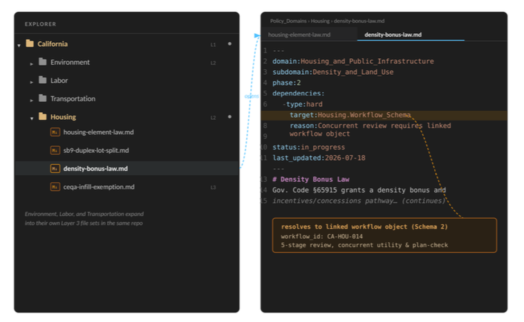
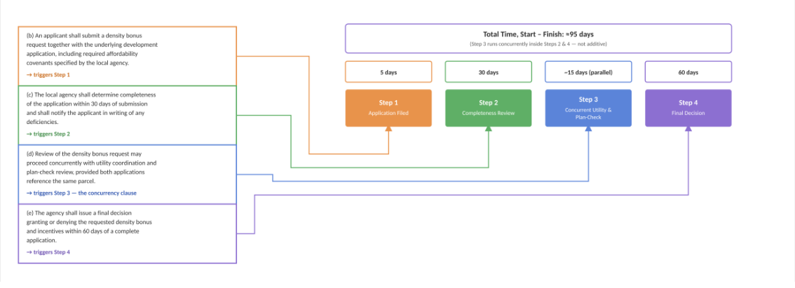
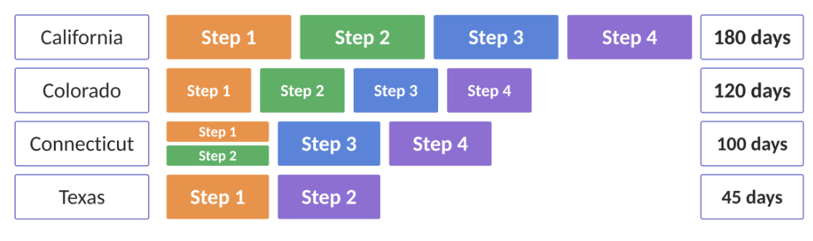
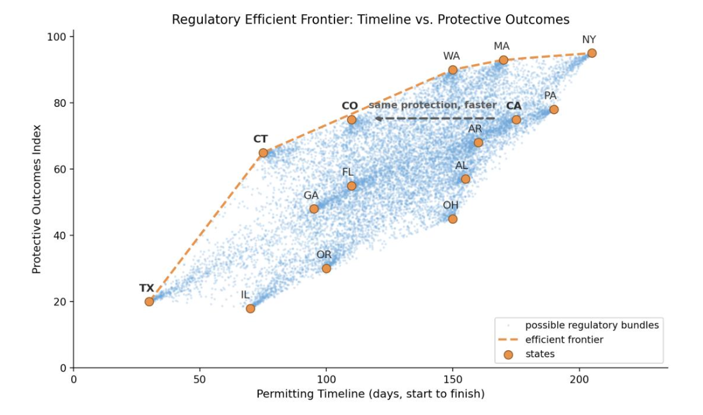
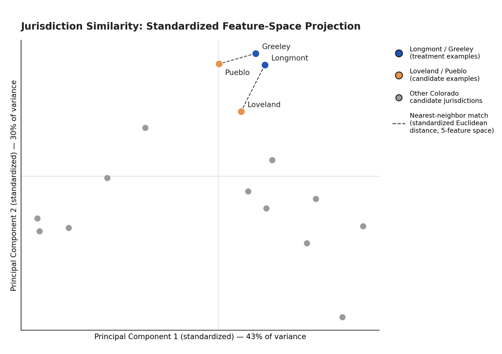
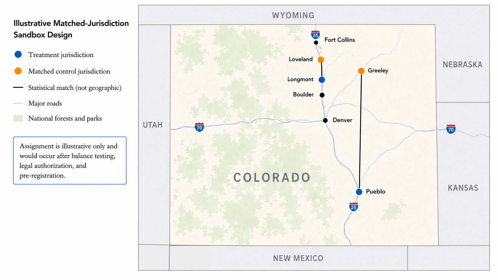
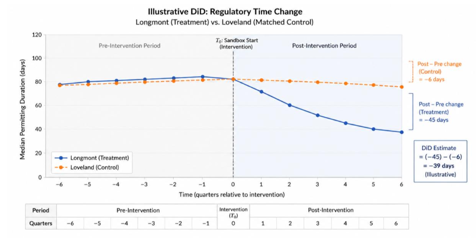
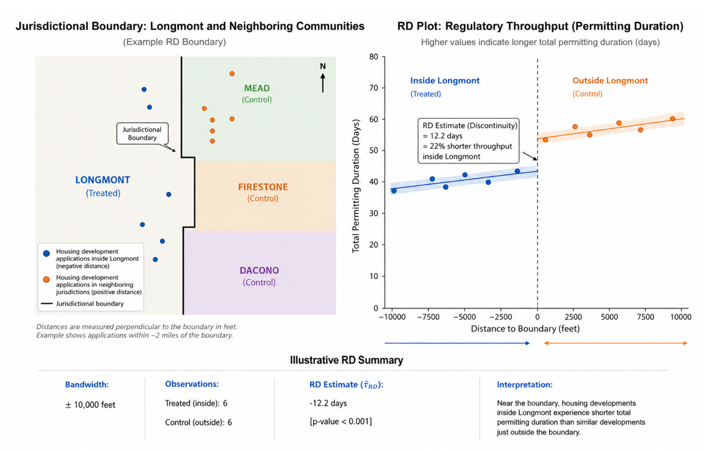
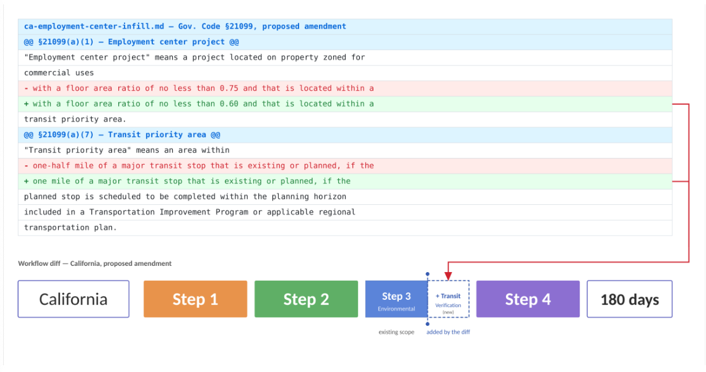
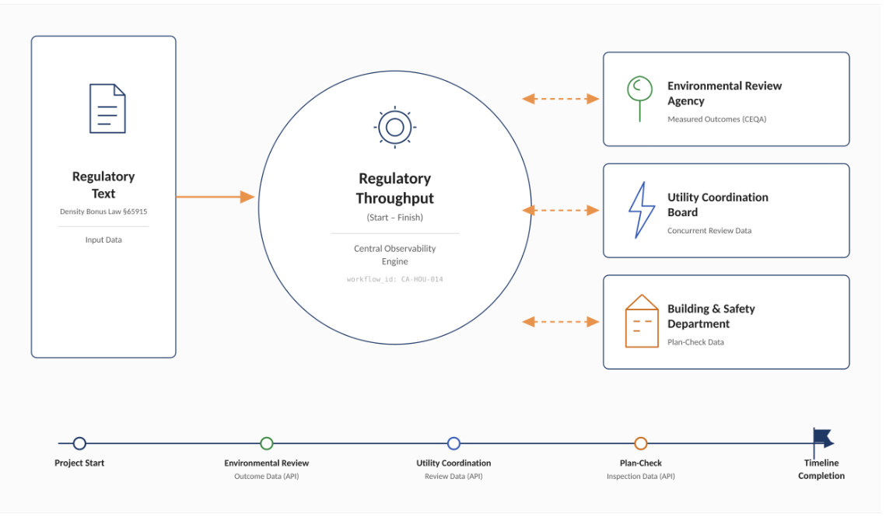

> **Illustrative Sample:** This draft is meanth to illustrate how legal, regulatory rules, and administrative workflows can be represented and optimized. It also shows how causal analysis can be encorporated into a policy proposal and tested locally to discern the changes it makes to these workflows before being implemented jurisdiction wide adoption. It is not an finished implementation proposal, nor is it a finished case study demonstrating that the architecture has worked. 

# GovOps

## The Application of Engineering Principles for the Continuous Optimization of Public Administration

### Executive Overview

We have different words for it -- Vetocracy[^1] -- Kludgocracy[^2] -- Everything Bagel governance[^3]. But the failure is familiar - Governments increasingly fail at executing on their own goals even when expertise, funding, and clear democratic mandates are all present[^4]. The problem is a cumulative one. The state has accumulated layers of statues, regulations, court decisions, and agency procedures as a defense for past abuse, but the result is a regulatory system that no institution can fully read, parse or maintain. 

While each of these reforms made sense in isolation, their aggregate effect has brought operational throughput to a crawl [^5], costs have exploded relative to peer countries [^6]. And political debate consequently defaults to a dichotomy between maintaining the opaque and systemic 'kludge' as it was implemented for our safety, or broadly removing safeguards writ large without regard for which ones serve a legitamate public purpose, and which ones just increase the beuracratic lift required to accomplish a task. 

GovOps supplies the missing maintenance layer for these systems. It links the legal text of a regulation with a direct operational schema to observe how that text is translated to agency procedures. It enables direct comparison of both protective indeces (e.g. clean air, clean water), operational throughput, and legal text across state and local jurisdictions. It proposes a regulatory sandbox structure that compares a proposed change with matched controls. And finally, it maintains it all in a machine readable and version controled environments that enables line-by-line traceback to which lawmakers proposed which packet and when, with merge packets detailing the exact changes in throughput and protective indeces.  


# 1. The Implementation Crisis

At their core, regulations are a set of instructions – building a house requires permits from Agency X – building a factory requires approval from Agency Y – wastewater cannot be disposed without meeting standard Z. This is the critical software that governs how things get done in the real world.

But unlike modern data and software systems which enable the full spectrum of 'Create', 'Read', 'Update', and 'Delete' functionality, regulatory systems only enable 'Create' and 'Delete' functions. Similar issues have been solved in the private sector, as 'big tech' companies have utilized monorepositories to govern systems that serve billions of active users, and are continuously worked on by thousands of engineers simultaneously. They accomplish this complexity management through systems that enable structured representations, dependency mapping, observability, version control, controlled experimentation, and continuous improvement.

GovOps adapts those disciplines to government administration with the objective being: make systems observable, testable, auditable, and revisable. 

## Design Constraints

The legal text remains the law. The dual schema models are traceable workflow projections, but changing the underlying legal text still requires approval from lawmakers. Furthermore, a sandbox produces evidence rather than law, and deployment still requires approval from an applicable authority. 


# 2. Dual-Schema Regulatory Architecture

GovOps represents every regulatory object through two linked representations. The legal schema contains the authoritative statute, regulation, order, or judicial interpretation with metadata containing the jurisdiction, relevent agency, effective date, scope, amendments, dependencies, and version history. 

The workflow schema connects to the first schema via foreign key and models the implementation details it produces (be that stages, documentation, agency reviews, inspections, permits, appeals, etc.). Persistent identifiers link each clause of legal text to it's consequential workflow implementation. 


This connection is maintained by representing the legal text as a machine-readable (markdown) document. Each legal document is stored in a repository that allows broader analysis, and each document contains a YAML header that allows software to recognize, organize, and understand it. 



*Figure 1. Repository organization: Each policy document is stored in a folder directory regarding its jurisdiction and domain. Users would be able to navigate the directory to quickly find the legal text of Colorado's environmental policy, for example. Each document within this directory contains YAML frontmatter storing applicable metadata*


```yaml
---
domain: [Domain_Name]
subdomain: [Subdomain_Name]
phase: [0-6]
dependencies:
  - type: [hard|soft|optional]
    target: [Domain.Subdomain]
    reason: [Brief explanation]
status: [draft|in_progress|review|complete]
last_updated: [YYYY-MM-DD]
---
```
*Figure 2. YAML metadata Example*

The YAML 'frontmatter' on the head of each document enables database style operations to quickly compare the legal text between jurisdictions like California, Alabama, and Colorado. It also enables the clauses of each document to be explicitly linked to the operationa workflows they create.



*Figure 3 represents how each clause of legal text can be explicitly linked to the workflow stage that it creates.*

When implemented on a national scale, one common repository supplies regulatory landscapes, operational throughput, and  version histories across jurisdictions. This step also enables higher level comparative functions. 

# 3. Workflow Intelligence and Regulatory Comparison

The first of the comparative functions that GovOps enables is the direct comparison of operational systems that jurisdictional legal text produces. Figure 4 serves as an example. 



*Figure 4 serves as an example of how this regulatory comparison works. Imagine the regulatory approvals needed to build a solar farm. This figure illustrates the permits (and their applicable timelines) needed in order to accomplish the work.*

In this example California represents the baseline. Colorado preserves an identical sequence of regulatory steps while completing each stage more efficiently, thus completing the process with 60 days to spare. Connecticut despite taking longer than Colorado on each individual step, executes steps 1 and 2 concurrently and thus shaves 20 days off of the regulatory approval time needed in Colorado (despite each step taking longer in isolation). Texas follows a fundamentally different strategy by ommiting intermediate review stages entirely. This turns their regulatory regime into a two step process that comprises of what would be step 1 and step 4 in any other regulatory regime measured. This represents the 'de-regulation' approach, which shaves the regulatory approval process down to 45 days -- the shortest on this list -- but also comes at the cost of a lower protective index as is illustrated in Figure 5. 

This serves as an illustration of the type of analysis that GovOps can produce. It distinguishes between faster execution of the same protections, concurrent sequencing of independent reviews, removal of duplicated steps, and the removal of legitamate protection. In this instance, California and Colorado can learn from Connecticut's concurrent sequencing of steps 1 and 2. Likewise, Connecticut and California can learn from Colorado's executional efficiency, which allows it to execute the same steps in less time. Each state can learn from Texas if the removal of intermediary steps does not translate to a substantive loss in protections. 

This turns the classic "more versus less regulation" debate into a diagnosis of stages, dependencies, handoffs, durations, and outcomes, all the while giving lawmakers tracability into the applicable letter of the law. It also enables the type of analysis illustrated in Figure 5. 



*Figure 5 Illustrates an Efficient Frontier concept from the finance industry applied to government regulations.**

Each sample jurisdiction is plotted in Orange in terms of operational throughput (Think: steps 1 through 4 from figure 4, from start to finish) and relative protective outcomes. Here, the cost of traditional 'de-regulation' is laid bare. States that seek to increase operational throughput at the expense of protection increase their risk relative to other jurisdictions. 

The blue dots between states represent the permitting throughput vs. protective outcomes that would result if the individual clauses of the legal text of each state were cut and recombined to create a jurisdictional regulatory regime at a different location on the frontier. The orange-dotted line represents the highest operational throughput for a given level of risk. 

Importantly, while this gives lawmakers legibility into how they can improve the efficiency of their regulatory regimes, it does not by itself give states a way to test new regulatory methods in ways that are safe, bounded, and produce the data they need to make informed decisions. This is detailed in part 4. 


## 4. Experimental Governance: The Scientific Methodology - Applied to Gvoernment Systems. 

Despite the legibility offered by the systems above, experiments in the real world have established that 'theory' is not entirely consistent with real life. Therefore, lawmakers need a structured and easy-to-use methodology for testing changes to their state's regulatory regime in a way that is (as aforementioned) safe, bounded, and automatically produces the data they need to make informed decisions aobut scale or sunset. 

To respond to this question, the Regulatory Modernization Sandbox (RMS) is proposed. The RMS is a legally authorized 'branch' of the regulatory system, in the same sense that codebase changes are 'branched' and tested in a bounded and isolated environment. Each sandbox is administered by a Regulatory Modernization Corps (RMC) deployment - government personnel that embed alongside the agencies responsible for executing the workflow under study, or to the site of the regulatory change (alongside local stakeholders) to directly observe how changes effect operations on the ground. 

This setup ensures that friction points are identified through direct observation rather than reconstructed retroactively from complaints, hearings, or reports delivered (often years later). 

### Site Selection and Experimental Design 

Sandbox jurisdictions are selected for causal identification rather than convenience. As an illustrative walkthorugh, the following figures display a Colorado housing-permitting design. Suppose a change to housing regulations is proposed, and lawmakers want to discern how this proposal changes the amount of time it takes to get the permits needed to build a housing development. 

Candidate sandbox jurisdictions are selected by comparing features applicable to median permitting durations, and permitting volumes in Colorado jurisdictions. From there, sites are selected according to how well they match up to synthetic control jurisdictions, as identified through Standardized Euclidean Distance, propensity scores, Mahalanobis distance, or synthetic control weights. As an example: 


| Jurisdiction | Population | Median household income | Population density | Owner-occupied housing | Median age | Permitting volume | Median permitting duration |
|---|---|---|---|---|---|---|---|
| Pueblo | 112,000 | $54,000 | 3,200 | 61% | 39 | *Illustrative* | *Illustrative* |
| Greeley | 111,000 | $60,000 | 3,700 | 63% | 36 | *Illustrative* | *Illustrative* |
| Longmont | 101,000 | $82,000 | 3,900 | 58% | 37 | *Illustrative* | *Illustrative* |
| Loveland | 82,000 | $76,000 | 3,400 | 64% | 41 | *Illustrative* | *Illustrative* |

> *Figure 6:* The values above are illustrative and are meant to exemplify how candidate sites can be selected using nearest-neighbors matching from candidate metrics. Each row represents a potential treatment or control jurisdiction. Each column represents a standardized demographic, economic, housing adjacent, or administrative characteristic used in the matching procedure. An applicable model would include a more robust feature spacce (featuring target variable relevent clearning, feature selection, etc.)

From there, applicable treatment-control jurisdictional pairs are selected according to their eligibility. Figure 6b and Figure 6c displays a potential candidate selection using this functionality.



> *Figure 6b. Matching algotrithms use the feature matrix from Figure 6 to find pairs of jurisdictions that are 'close enough' for us to compare them against each other with statistical power. Notably, this matching criteria does not include geographic closeness. This is a principal-component projection of the featurespace in Figure 6. The final featurespace could be north of dozens of applicable dimensions*

And once applicable jurisdictons are selected, they undergo a time-bounded sandbox treatment of potential regulatory changes. 



>*Figure 6c: Illustrates the geographic distribution of treatment-control jurisdictional pairs in Colorado.*

### Evaluation 

Once the treatment-control pairs are selected, a Regulatory Modernization Packet (RMP) is prepared to test changes to the regulatory environment and how these changes affect both the median permitting duration as well as the relative protective index. This setup allows lawmakers to test regulatory changes in a bounded manner while minimizing the risk of immediate statewide roll out. Figure 7 illustrates a 'Difference in Differences' output comparing the median housing permitting time for one matched jurisdictional pair. 



The intervention (piloted regulatory change) begins at T₀. In this illustration, the treatment jurisdiction (Longmont) experiences a reduction in median permitting time duration relative to its matched control (Loveland). 

Regulatory outcomes can also be evaluated using regression discontinuity at jurisdictional boundaries as illustrated in Figure 8. This is an important step as geographically separated areas might use different builders, staff, contractors, material suppliers, and so on. 

The addition of a regression discontinuity at a jurisdictional edge allows us to more effectively isolate the effect of the regulatory change as housing development projects close to Longmont will naturally use similar contractors, staff, builders, etc. 



### Independent review and the dual key

Importantly, the government cannot be allowed to designs, measures, and certifies its own experiments -- otherwise we are recreating the same 'grade your own work' failure that this setup is meant to avoid. As such, the methods above are combined with a dual-key evidence system built to replicate the peer review structure in scientific fields. 

As an overview, this would work by an official evaluating body certifying: baseline conditions, data collection methods, and statistical methods. A seperate Independent Research Review panel -- composed of accredited universities, nonpartisan research institutions, or other public policy labs -- evaluates the site selection, experimental design, data collection, statistical validity, reproducability and interpretation of the findings. 

**Disclaimer:** While these methods are good statistical approximations of a controled experiment, they are not equivalent to laboratory control. Statistical techniques can construct a counterfactual, and strengthen causal evidence, but they cannot eliminate all potential confounding variables or produce irrefutable conclusions. Those limitations do not constitute an argument against evaluation in this manner. Even imperfect causal measurement is a substantial improvement over the current status quo, in which policies are often implemented without a rigorous mechanism for determining whether they can acheive their intended outcomes. 

## 5. From Sandbox to Statute

Upon the completion of a successful pilot, the data and pilot results are automatically encorporated into a Regulatory Modernization Packet (RMP) which contains the amendment to the regulatory environment - containing a 'legal diff' of the exact language change to statute, a 'workflow diff' of the dual-key certified workflow change, and any applicable notes or evidence. An example is illustrated in Figure 9. 



While a successful pilot does not automatically become law, pilot programs can be pre-certified to default to scaling or sunsetting according to certified performance metrics. Under this setup if performance metrics are achieved, lawmakers must explicitly intercede to stop it a pilot from scaling -- or in the case of the counterfactual -- lawmakers must intercede to saving a program if it does *not* meet performance metrics.  

In any case, after the applicable legislative approval, the packet merges into production. The division of labor in this system is explicit: the legislature authorizes the experiment, agencies implement, and independent certification bodies certify performance. 


## 6. Encorporating Automation for Longterm Efficiency

Once the system is setup, the workflow objects may be connected via standard APIs to permitting, inspection, procurment, appeals, and other applicable agency systems. In the long term, each submission, handoff, inspection, appeal, and deadline can become connected and timestamped events that automatically record telemetry mechanics as day-to-day operations procede across a state. 

The long term goal is a government that has legibility into the differences between active agency work and queue time, locate bottlenecks and dependency failures, and so on -- althewhile lowering the documentation requirements that burden beuracratic processes. 



>*Figure 6: Rather than exchanging information through sequential document transfers, participating agencies share operational and permitting telemetry thorugh APIs with the Workflow database. This gives lawmakers real-time feedback into the operations their work creates.*

## 7. Version-Controlled Governance

This digital structure also enables lawmakers to search for broken dependencies, critical gaps in regulatory frameworks that have been solved elsewhere, and enable lawmakers to 'rollback' changes if previously unidentified problems arise. 

Preserving this structure also enables greater transparency for the public, as they can observe line-by-line authorship of laws by State or Federal lawmakers, which also enables a greater degree of cross examination if lawmakers write clauses and loopholes into 1,000 page documents that suspiciously exempt their donors from taxes, regulatory changes, or similar. 

## Guardrails

As a disclaimer, any changes that carry environmental, physical, health, or human rights consequences require a much stricter burden of proof attached to a staged rollout. Additional care will have to be taken with regard to data privacy, and measures will have to be taken so as not to centralize cyber risk. 

## 9. Discussion: Enabling Continuous Institutional Maintenance

Governments have long had institutions capable of creating law, but they have persistently lacked comparable institutions for understanding, maintaining, and improving the increasingly complex administrative systems those laws create.

GovOps is a technological maintenance layer designed for this purpose -- not as a replacement for government, but as an augmentation of its existing institutions. It connects the legal text drafted by lawmakers to the operational workflows that implement it, makes those systems observable through structured data and dashboards, and provides governments with a disciplined pathway for piloting, evaluating, and improving regulatory frameworks over time.

If successful, GovOps would fundamentally improve the regulatory lifecycle. Legislatures and agencies retain their existing authority to create laws and regulations, but gain sharper tools and greater visibility into the systems those decisions produce. They can observe how regulations perform operationally, compare outcomes against their stated objectives and relevant peer jurisdictions, identify bottlenecks and unintended consequences, and test bounded changes before adopting them more broadly. Over time, accumulated evidence can also inform when regulatory frameworks should be revised, consolidated, or deprecated altogether.

The larger objective is to make regulatory systems legible as integrated operations: to show how legal changes alter implementation, measure whether those changes achieve their intended outcomes, and create institutional capacity for continuous improvement. The result is a disciplined middle path between accumulated regulatory opacity and indiscriminate repeal—preserving democratic authority and public purpose while giving government better tools to maintain and improve the machinery through which they are expressed.


## References 

[^1] Fukuyama, Francis. Political Order and Political Decay: From the Industrial Revolution to the Globalization of Democracy. New York: Farrar, Straus and Giroux, 2014. pg.514 - 517

[^2] Teles, Steven M.. Kludgeocracy: The American Way of Policy. Washington, D.C.: New America Foundation, 2012. pg. 5-6

[^3] Ezra Klein and Derek Thompson, Abundance (Avid Reader Press, 2025), pg.113.

[^4] Ezra Klein and Derek Thompson, Abundance (Avid Reader Press, 2025), pg.71-78.

[^5] Teles, S. M. (2013). "Kludgeocracy in America." National Affairs, 17, 97-114.

[^6] Ezra Klein and Derek Thompson, Abundance (Avid Reader Press, 2025), pg.77.
