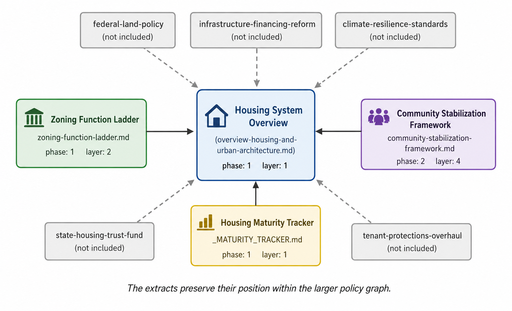

# Machine-Readable Policy Architecture

## The idea in one sentence

A policy platform can be maintained more like a complex engineered system: each proposal has a stable identity, declares its relationships to other proposals, advances through explicit maturity gates, and contributes to a continuously updated picture of the whole.

> **What this is:** A demonstration of the proposed repository structure applied to a policy-development workflow.


## The problem

Large policy agendas are usually assembled as collections of papers. An individual green energy policy might be thoughtful, but it can still fail if it is deployed on an outdated permitting system, if it cannot connect meaningfully to fiscal policy mechanisms, or if upstream supply chain effects create artificial bottlenecks. Policies, unlike their paper representations, are deployed into a larger system with gaps, dependencies, and other constraints. But our methods for developing these policies do not allow us to fully map and account for these relationships before implementation exposes them. 

Many of these same issues have been solved in other fields. The question is therefore how we import these solutions and synthesize them into a system that is usable by lawmakers, and is able to answer the following questions reliably: 

- Which parts of this policy depend on mechanisms from other policy areas? 
- Where are the largest unaddressed gaps in our proposed healthcare system?
- Does the institution that this policy depends on have the capacity to implement it? 
- Which reforms must precede others?
- Do two domains make incompatible assumptions?
- Which audiences are affected by a proposal?
- Will this policy survive contact with a potentially hostile media environment? 
- Which parts of the agenda are mature, and which are still conceptual?

A conventional table of contents cannot answer those questions. The repository therefore treats each brief as *both* a human-readable document and a machine-readable object.

## The demonstrated method

Every policy object begins with YAML front matter. The prose explains the proposal; the metadata explains where the proposal sits in the larger system. As an example, the YAML front matter for an object might look like: 

```yaml
---
id: regional-wage-modernization-pilot
title: Regional Wage Modernization Pilot
domain: Labor_and_Economic_Security
subdomain: Wage_Modernization
phase: 1
layer: 4
audiences:
  - rural-america
  - veterans
  - working-class
dependencies:
  - doda-regional-wage-heatmap
  - benefits-gradient-modernization
tags:
  - regional-pilot
  - evidence-gated
---
```

The fields above are not decorative labels. The id serves as both a document name, and as a *primary key* -- a special field that serves as a unique identifier for this particular policy in a larger corpus. That unique identifier might be used in the *dependencies* field for other policies to allow codebase management software to correctly identify this measure as one that needs to occur upstream or concurrently with other proposals. Likewise, the domain, subdomain, layer, audiences, tags fields encode similarly important information that make several repository-wide operations possible.

### Stable identity and foreign-key relationships

As briefly mentioned earlier, the `id` gives each proposal a durable identity. Fields such as `dependencies` and `related_instruments` refer to those IDs, creating relationships in the policy platform analogous to foreign keys in a database.

That permits automated questions such as:

- What breaks if this instrument is delayed?
- Which proposals depend on the same institution?
- What steps need to occur, in order, for this policy domain (e.g. Healthcare, Public Housing) to be implemented? 
- If this policy proposal is abandoned, what are the ramifications for the rest of the platform? 
- Is a supposedly standalone proposal actually downstream of several unfinished reforms?

### 'Phase' completion discipline

Each brief is assigned a maturity phase. Early phases define the problem and architecture, while later phases require research integration, pilot design, implementation planning, external review, and revision. The critical feature here is not the number of phases we define. It is that advancement is tied to observable conditions. A brief cannot become “implementation ready” merely because its prose is polished. Its dependencies, evidence, legal vehicle, evaluation plan, and unresolved risks must mature with it. 

The result of this is a public facing policy platform that has expert review, evaluation planning, risk mitigation, validation against existing research, and other types of scoring built-in to the platform itself. A communication layer might explain to a voter what policies are explicitly designed to address their needs. An institutional layer gets the budget scoring and other receipt mechanisms to prove that the policy is serious.  

### Audience and cross-domain analysis

Audience tags make it possible to generate views of the platform for different affected groups without maintaining separate, drifting copies of the same policy. Domain and subdomain fields support aggregation. If institutional actors are concerned about how the policy platform plans to address the concerns of one community in particular (e.g. rural-voters, farmers, black-community), these tags can be used to pull the relevant information without creating a stale copy of the larger document corpus (that may be updated within days or weeks), and replaces it with an updated dashboard that is directly tied to the most recent editions of policy documents and can be updated automatically as changes to the underlying corpus are published. 

This also allows us to map dependencies that would otherwise have been obscured. For example, policies affecting rural voters might be a combination of healthcare, financing, right-to-repair, agricultural coordination, housing, and so on. Policies affecting the black community in a particular state might look different on the surface, but depend on similar financing mechanisms, or institutional constraints. The cross-domain analysis offered by this platform allows those dependencies to be explicitly mapped, mitigated, and pulled into meaningful information for lawmakers that says: "These voters are affected if this obscure institutional reform fails". 

### Gap analysis

Maturity trackers summarize what exists, what is missing, which dependencies are blocking progress, and what work should happen next. In a complete repository, these records support platform-level gap analysis rather than relying on institutional memory. For example, an agricultural domain that is still lacking finance depth (which may depend on reforms in other domains like fiscal policy), is clearly surfaced in this system when that would otherwise depend on a manual detection and handoff between two different people usually. 

## Worked example: housing as a connected domain

The included housing extracts show multiple levels of the architecture:

1. The [housing system overview](../samples/Policy_Domains/Housing_and_Public_Infrastructure/overview-housing-and-urban-architecture.md) describes how individual instruments fit together.
2. The [zoning function ladder](../samples/Policy_Domains/Housing_and_Public_Infrastructure/zoning-function-ladder.md) demonstrates a single instrument with declared dependencies and related initiatives.
3. The [community-stabilization framework](../samples/Policy_Domains/Housing_and_Public_Infrastructure/community-stabilization-framework.md) shows a more mature brief that has passed through research integration.
4. The [housing maturity tracker](../samples/Policy_Domains/Housing_and_Public_Infrastructure/_MATURITY_TRACKER.md) summarizes domain status and gaps.

NOTE: The references to policies not included in this public extract are intentionally preserved. They show that the visible briefs were removed from a larger relational system rather than written as isolated portfolio pieces.



> **Figure 1: Dependencies in the Housing Domain are preserved** This figure shows a visual representation of how relevant information and dependencies may connect a document to others, and yet ignore documents that are not implicated. 

## What this demonstration establishes

The extracts establish that policy documents can be represented in a form that supports both substantive reading and computational maintenance. They demonstrate a plausible mechanism for:

- dependency validation;
- phase-aware sequencing;
- audience-specific views;
- cross-domain gap detection;
- shared metadata standards; and
- portfolio-level status reporting.

## What it does not establish

The demonstration does not prove that the particular schema is complete, that every dependency has been correctly identified, or that structured metadata can resolve substantive political disagreement. A graph can expose a dependency; it cannot decide whether the underlying policy is wise.


## What a future team owns

A future team would decide:

- its policy priorities and substantive positions;
- the metadata fields appropriate to its workflow;
- the meaning and gate conditions of each maturity phase;
- who may create, review, approve, or retire policy objects;
- how disagreements and exceptions are recorded; and
- which automated checks should block publication or implementation.

The policies used as an example in this platform are not the primary object, rather it is the method for organizing those policies -- using machine-readable documentation to make a large body of policy work coherent, inspectable, and maintainable.

## Underlying evidence

- [Architecture reference](../ARCHITECTURE.md)
- [Project status and sample gap analysis](../PROJECT_STATUS.md)
- [YAML front-matter guide](../AI_Integrations/YAML_FRONTMATTER_GUIDE.md)
- [Housing maturity tracker](../samples/Policy_Domains/Housing_and_Public_Infrastructure/_MATURITY_TRACKER.md)
