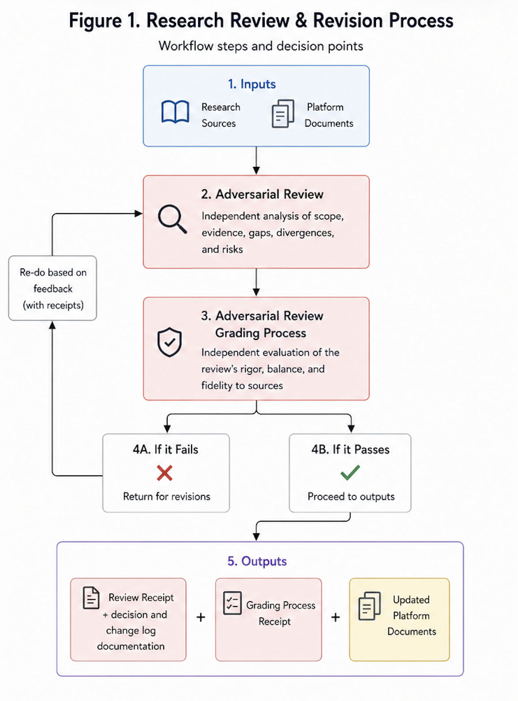
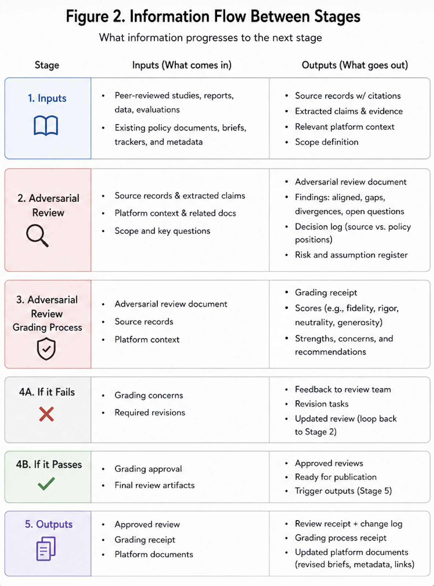

# Research Integration and Adversarial Revision

## The idea in one sentence

What if we utilized the machine-readable nature of a policy platform, along with modern technology to pull relevant research and case studies, and then use them for an adversarial review of our platforms assumptions before going public, in an automated fashion? 

> **What this is:** A worked example of a source moving through ingestion, adversarial review, independent grading, and policy revision.
>
> **What this is not:** A claim that one paper validates an entire community-safety strategy.

## The problem

Policy documents (and policy debates) often use research selectively. Evidence that supports the preferred proposal is cited, while evidence that complicates it is softened, omitted, or treated as irrelevant. This creates problems when the platform eventually makes contact with the media and the electorate it is supposed to serve. Furthermore, even good-faith review can reproduce the assumptions of the team that commissioned it, and might still leave gaps accordingly. 

This section asks a different question. What if we utilized the machine readable nature of a platform, and then conducted an adversarial review using every case study and piece of relevant research we could get our hands on? Such a platform could take relevant critiques, and adapt itself to that criticism, or (if critiques are rebutted) proceed in a self-aware manner -- with receipts. 

In this regard, research should not merely supply citations after a policy has been written, it should fundamentally challenge the policy's mechanisms, expose unsupported assumptions, document disagreements, and produce a traceable revision record. Like simulating how a bridge holds up in a hurricane, this review serves to make the platform stronger -- with evidence and receipts -- before it ever makes contact with the media. 

The specific failures this process is built to avoid are:

- correlation is described as causation
- evidence for one intervention is generalized to a much larger program
- evidence for one intervention is generalized towards an adjacent intervention that the evidence does not actually support
- silence is mistaken for contradiction -- or for support
- disagreements are buried rather than recorded
- policy changes cannot be traced back to the evidence that caused them
- reviewers evaluate whether a document sounds persuasive rather than whether its inferences are disciplined

The research-integration workflow is designed to make those failures visible. Instead of designing a bridge for ideal conditions, we do the stress testing up front, so we have a log of design changes and receipts long before the infrastructure gets built. 

## The demonstrated workflow

> *Figure 1:* The demonstrated workflow flows through strict phase gated steps: **Source → Structured review → Independent grading → Revised brief**. Each step only proceeds with the necessary information, and steps do not proceed unless the necessary conditions are met. 

## The Workflow Applied to a Specific Example: 
The following example provides a demonstration of the adversarial research workflow applied in a specific example. In this case, a policy document proposing a crime reduction strategy involving changes to the built environment is stress tested against a case study undertaken in Dallas by a Government Consulting and Technology Company, 17a. 

### Step 1: Preserve the source record

The source record for the relevant document is stored directly in the research section of the platform: the [17A source record](../research-library/sources/17a-reducing-violent-crime-2026.md). The PDF for the case study is ingested using a python script and the citation metadata is stored with topical tags, linked briefs, and extracted source content. This gives later reviewers a stable research object rather than an informal link or a detached set of notes.

### Step 2: Define the source's scope

Before asking whether the source supports the policy, the review asks what the source itself attempts to establish. This prevents a narrow paper from being faulted, for failing to address unrelated questions, or for being used as 'evidence' to support a larger policy proposal that its scope does not actually support. 

The scope section becomes the reference point for four subsequent categories:

- **Aligned findings:** evidence consistent with a policy mechanism;
- **Gaps:** relevant questions within scope that remain unanswered;
- **Divergences:** places where the source qualifies or challenges the proposal; and
- **Open questions:** remaining uncertainties that could change the design.

### Step 3: Separate evidence from inference

The [adversarial review](../research-library/reviews/community-stabilization-violence-research-review.md) repeatedly distinguishes what the 17A example demonstrates from what the policy team infers.

For example, the source provides evidence that violent crime and environmental disorder are geographically concentrated and that focused environmental interventions can reduce violence. That supports place-based targeting. It does not, by itself, prove that every component of a larger federal coordination architecture will work or that the same effects will generalize at every scale.

This distinction is the center of the workflow: “evidence consistent with this mechanism” is not the same statement as “research validates the platform.”

### Step 4: Record divergences and decisions

The review does not end with a literature summary. It creates a decision record. For each meaningful tension surfaced between the existing policy proposals and the literature review, it states:

1. the source position
2. the policy position
3. the justification for retaining or changing the policy design
4. the strongest counterarguments and
5. the response or unresolved question.

This makes value judgments and inferential leaps inspectable. A team may still disagree with the source, but it must say why.

### Step 5: Grade the review independently

The [grading receipt](../research-library/reviews/validation/community-stabilization-violence-research-review-grading.md) evaluates the review itself for source fidelity, inferential discipline, framing neutrality, and generosity toward the proposal.

This second pass matters because an adversarial review written inside the same conceptual environment can still rationalize the original design. Independent grading does not eliminate judgment, it introduces another set of priors and records where the two reviews differ.

### Step 6: Revise the policy

The [revised community-stabilization brief](../samples/Policy_Domains/Housing_and_Public_Infrastructure/community-stabilization-framework.md) incorporates design changes associated with the review, including:

- an explicit weekly operating cadence
- adaptive targeting rather than a static site list
- continuing maintenance requirements
- a protocol for locations where violence and housing instability co-occur and
- clearer distinctions between near-term environmental effects and longer-term social mechanisms.

The point is not that these are necessarily the correct final choices. The point is that a reader can follow the reasoning from research finding to design decision.

> **Figure 2:** A four-column evidence chain. Under each artifact, show one representative output: source claim, adversarial qualification, grading comment, and resulting brief revision.

## What this demonstration establishes

The example demonstrates a research workflow that can:

- preserve source provenance
- discipline claims to the scope of the evidence
- distinguish support from extrapolation
- surface divergences rather than erase them
- record why the team changed or retained a design and
- connect a revised proposal to its research history.

## What it does not establish

This process does not guarantee an unbiased conclusion. Templates, source selection, model prompts, and human judgment can all introduce bias, and a single source does not cover the full evidence base. This workflow is best understood as an auditable research trail rather than absolute truth. When used correctly with adversarial testing for every open question, it creates a validated chain of evidence that strengthens the platform's overall design choices.

## What a future team owns

Again, the specific policy example contained in this walkthrough is meant as an illustration of the *process*. A future team would determine:

- which sources are sufficiently credible and relevant to ingest
- how reviewers are selected and separated
- what standards govern causal language
- when a divergence requires revision, additional research, or an explicit values judgment
- what evidence is sufficient to advance a proposal and
- who has authority to accept the final design decision

The reusable feature is the chain of custody from evidence to policy—not the substantive conclusion reached in this example.

## Underlying evidence

- [Research-library index](../research-library/index.md)
- [17A source record](../research-library/sources/17a-reducing-violent-crime-2026.md)
- [Research review](../research-library/reviews/community-stabilization-violence-research-review.md)
- [Independent grading receipt](../research-library/reviews/validation/community-stabilization-violence-research-review-grading.md)
- [Revised community-stabilization brief](../samples/Policy_Domains/Housing_and_Public_Infrastructure/community-stabilization-framework.md)
