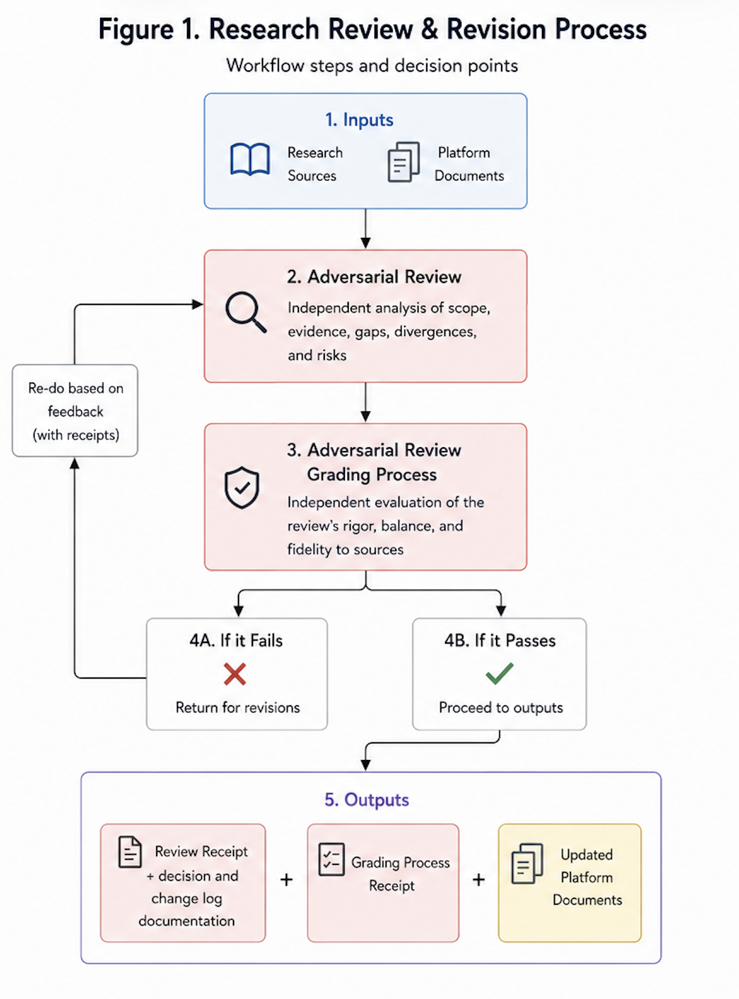
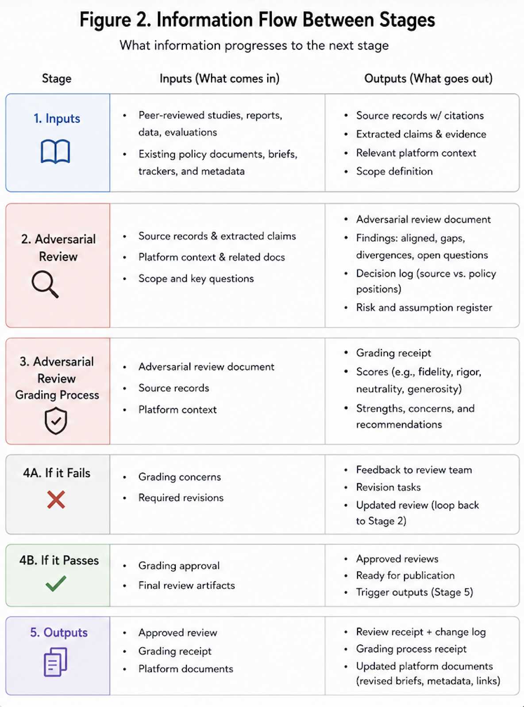

# Research Integration and Adversarial Revision

## The idea in one sentence

What if we utilize the machine-readable nature of the policy platform we've built, automatically pull in relevant research and case studies for each proposal, and use them to adversarially review the platform's assumptions before it ever goes public?

> **This is:** An example of an automated review process including an LLM-as-judge, and a human-in-the-loop. We're documenting a single source moving through ingestion, adversarial review, independent grading, and policy revision. **This is not** a claim that one paper validates an entire community-safety strategy by itself. 

## The problem

Policy documents (and the debates around them) tend to use research selectively. Evidence that supports the preferred proposal gets cited; evidence that complicates it gets softened, omitted, or dismissed as irrelevant. This works well enough inside the room where the platform was written, but it becomes a liability the moment that platform makes contact with the media and the electorate it is supposed to serve. Even good-faith review is not immune, since reviewers commissioned by the same team often share its assumptions and, as a result, leave the same gaps.

Imagine instead a platform that has already heard its strongest critics before a single reporter reads it. Because the platform wev'e built is machine-readable, every proposal can be tested against every relevant case study and piece of research we can get our hands on. Where a critique holds, the platform adapts; where it can be rebutted, the platform proceeds anyway, but it does so knowingly, and with receipts.

In this sense, we're not using research to supply citations after the policy has already been written. Instead we're pulling all of the relevant case studies we can, and using them to challenge the policy's mechanisms, expose unsupported or faulty assumptions, document disagreements, and leave behind a traceable record of every revision. Engineers do not design a bridge for a calm day and hope for the best. Instead, we simulate how the bridge holds in a hurricane first, and log every design change this simulation forces. This workflow intends to do the same for policy.

We're specifically attempting to target the following failures: 

- correlation described as causation
- evidence for one intervention improperly generalized to a much larger program
- evidence for one intervention being stretched to cover another intervention it does not actually support
- silence in the literature being mistaken either for contradiction (or for support)
- disagreements that will surface against the policy being buried instead of dealt with outright from the beginning. 
- policy changes that cannot be traced back to the evidence that caused them 
- reviews sound persuasive rather than actually supplying evidence that it will fix the problem

None of these failures are new, but what we are trying to do is make them visible before the program is public, instead of 5 years after the policy is implemented. 

## The demonstrated workflow

> *Figure 1:* The demonstrated workflow moves through strictly phase-gated steps: **Source → Structured review → Independent grading → Revised brief**. Each step receives only the information it needs, and no step proceeds until its conditions are met.

## The workflow applied to a specific example

To make the process concrete, this walkthrough follows a single stress test. A policy proposal for reducing crime through changes to the built environment is tested against a case study conducted in Dallas by 17a, a government consulting and technology company.

### Step 1: Preserve the source record

The case study lives directly in the platform's research library as the [17A source record](../research-library/sources/17a-reducing-violent-crime-2026.md). A Python script ingests the PDF and stores its citation metadata alongside topical tags, linked briefs, and the extracted source content. The intent behind this is to give later reviewers a stable research object to work from, rather than a link or a loose set of notes.

### Step 2: Define the source's scope

Before asking whether the source supports the policy, the review asks what the source itself sets out to establish -- because this can differ massively in scope from what the policy itself is trying to solve. For instance, a policy that seeks to lower crime rates might work through multiple mechanisms -- a paper or case study might be consistent with *one* of those mechanisms, while being silent on the others.

This step surfaces that discrepancy and states plainly what mechanisms in the platform still need validation or other case studies to prove their validity as well. 

This scope section then becomes the reference point for four categories:

- **Aligned findings:** evidence consistent with a policy mechanism;
- **Gaps:** relevant questions within the source's scope that remain unanswered;
- **Divergences:** places where the source qualifies or challenges the proposal; and
- **Open questions:** remaining uncertainties that could change the design.

### Step 3: Separate evidence from inference

Throughout the [adversarial review](../research-library/reviews/community-stabilization-violence-research-review.md), the analysis distinguishes what the 17A case study actually demonstrates from what the policy team infers from it.

For example, the source shows that violent crime and environmental disorder are geographically concentrated, and that focused environmental interventions can reduce violence. That supports place-based targeting. It does not, prove that every component of a larger federal coordination architecture will work, or that the same effects will hold at every scale.

This distinction is the center of the entire workflow: "evidence consistent with this mechanism" is not the same statement as "research validates the platform."

### Step 4: Record divergences and decisions

Instead of ending with a literature summary, this process ends with a decision record. For each meaningful tension between the policy proposal and the research, the record states:

1. the source's position
2. the policy's position
3. the justification for keeping or changing the policy design
4. the strongest counterarguments
5. the policy writer's response, or the questions that remain unresolved.

In this way, we evaluate every value judgment and inferential leap. A team may still disagree with the source, but it has to say why.

### Step 5: Grade the review independently

A separate [grading receipt](../research-library/reviews/validation/community-stabilization-violence-research-review-grading.md) evaluates the review itself for four key metrics: fidelity to the source (does the source actually say these things?), discipline (does the review infer accurately, or does it overreach?), bias, and sycophancy toward the proposal (does the review challenge our assumptions -- which is what we want -- or does it merely agree with us?). 

This second pass exists because an adversarial review completed by a tool that has been used on the wider project, or that contains broader project context, can still end up rationalizing the original design due to how LLMs are trained. To counteract this, a failed grading report automatically restarts the first process, sending it back with explicit feedback and receipts detailing exactly why the pass failed. This loop repeats until a passing grade is achieved.

This grading pass ensures that a second round of agents double-checks all page references, verifies claim accuracy, and confirms that the review is sufficiently adversarial against a set rubric before a human ever has to engage.

If this pipeline is successful, we will eventually be able to draft a policy proposal, hit 'Go', and have a team of agents Kirby up all relevant research, case studies, and historical precedents overnight. By the next morning, they will tell us where similar policies succeeded or failed, map out exactly where to modify our design to maximize success, and hand us a straightforward list of PDFs and page references to double-check their work. If it fails, our human analysts will be stuck fighting a firehose of information, unable to tell the difference between sycophantic slop and genuine insight. This separate agent grading process is what ensures the system actually delivers that first, successful outcome.

### Step 6: Revise the policy

Once the adversarial review is complete, the grades have passed, and the sources and page references have been validated, we can use the review to revise our policy proposal. 

As an example, the [revised community-stabilization brief](../samples/Policy_Domains/Housing_and_Public_Infrastructure/community-stabilization-framework.md) incorporates the design changes that came out of the review, including:

- an explicit weekly operating cadence
- adaptive targeting in place of a static site list
- continuing maintenance requirements
- a protocol for locations where violence and housing instability co-occur
- clearer distinctions between near-term environmental effects and longer-term social mechanisms.

The point is not that these are necessarily the right final choices. The point is that a reader can follow the reasoning from research finding to design decision, one step at a time.

> **Figure 2:** A four-column evidence chain. Under each artifact, show one representative output: source claim, adversarial qualification, grading comment, and resulting brief revision.

## What this establishes, does not establish, and what a future team owns:

This example shows a research workflow that can:

- preserve source provenance
- keep claims within the scope of the evidence
- distinguish support from extrapolation
- surface divergences rather than erase them
- record why the team changed or retained a design and
- connect a revised proposal to its full research history.

That being said, this process does *not* guarantee an unbiased conclusion. Templates, source selection, model prompts, and human judgment can all introduce bias, and a single source is never the full evidence base. 

This workflow is best understood as an auditable research trail, not a source of absolute truth. If it's applied consistently, with every open question put through the same adversarial testing, it builds a chain of evidence that makes the platform's design choices stronger and far easier to defend.

A future team would still need to decide on:

- which sources are credible and relevant enough to ingest
- how reviewers are selected and kept separate
- what standards govern causal language
- when a divergence calls for revision, additional research, or an explicit values judgment
- what evidence is sufficient to advance a proposal
- who has the authority to accept the final design decision

Ultimately, what carries forward is not the conclusion on housing policy in this specific example, but the chain of custody from policy proposal, to evidence, to policy revision that it demonstrates. That chain of custody and that process is the reusable piece here that can ultimately be used to harden every proposal the platform ever makes.

## Underlying evidence

- [Research-library index](../research-library/index.md)
- [17A source record](../research-library/sources/17a-reducing-violent-crime-2026.md)
- [Research review](../research-library/reviews/community-stabilization-violence-research-review.md)
- [Independent grading receipt](../research-library/reviews/validation/community-stabilization-violence-research-review-grading.md)
- [Revised community-stabilization brief](../samples/Policy_Domains/Housing_and_Public_Infrastructure/community-stabilization-framework.md)
