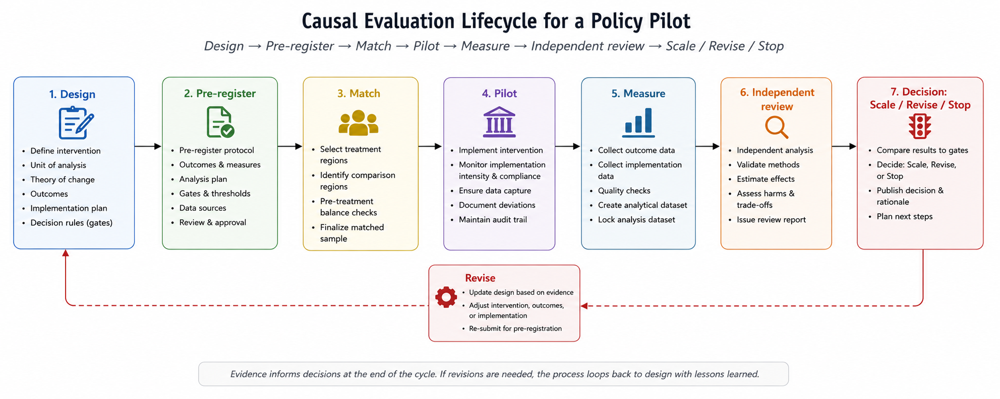

# Causal Evaluation Inside Policy Design

## The idea in one sentence

Can a policy be written as a bounded, evidence-gated intervention whose (third-party facilitated) comparison strategy, measurements, decision thresholds, and stopping conditions are present before implementation begins? 

> **What this is:** A demonstration of causal evaluation embedded in a policy proposal.
>
> **What this is not:** An endorsement of the proposed intervention -- in this case, wage level, regional formula, or institutional arrangement.

## The problem

Evaluation is often appended to policy after the important choices have already been made. Programs launch nationally, often with no designated evaluation criteria. Data systems arrive late, and evaluation is often incomplete and filtered through hyper-partisan media environments that are more adept at furthering a narrative irrespective of how successful a policy is at achieving its intended goals. To further complicate matters, success criteria for specific policies often remain vague and often non-falsifiable -- and evaluators are asked whether the policy “worked” without valid statistical analysis, counterfactuals, experimental design, or measurement. 

That makes several questions difficult or impossible to answer:

- What would have happened without the intervention?
- Which outcomes were selected before results were known?
- How large must an effect be to justify expansion?
- Which adverse effects should pause or terminate the program?
- Was a disappointing result caused by the policy mechanism or poor implementation?
- Can a successful result generalize beyond the pilot sites?

The regional wage example shows how those questions can become part of the policy architecture itself.

## The demonstrated design

The [Regional Wage Modernization Pilot](../samples/Policy_Domains/labor-and-economic-security/regional-wage-modernization-pilot.md) proposes a geographically bounded wage-floor experiment. Its substantive details are illustrative. Its structure with built-in causal analysis is the demonstration.

### 1. Define a bounded intervention

The proposal does not begin with a high-stakes federally universal intervention. Instead, it defines a limited pilot, a staged onramp, regional calibration, and institutional support intended to make the treatment observable and reversible. The evaluation criteria that determines whether the policy worked or not should be pre-specified using a validated methodology. The objective of this design is to make each policy a falsifiable intervention based on validated experimental methods with independent evaluation logic. 

As a special note: Despite the current political zeitgeist, any policy (with positive intent) that achieves its objectives benefits the nation, regardless of its partisan origin. Structuring policy interventions in this manner (with independent evaluation built-in) allows parties to compete with each other on merit instead of on narrative; it reduces the negative ramifications of failure; and it allows the country to use federalism to its advantage, instead of to its detriment. 

### 2. Specify the unit of analysis

This proposal uses commuting zones and regional labor markets rather than assuming that state boundaries describe the relevant economy. That choice connects the intervention to the geography in which workers and firms actually interact. In other policy proposals, the analysis should follow the mechanism. A future team might choose counties, firms, school districts, watersheds, hospitals, or individuals depending on the policy intervention in question. 

### 3. Build a comparison strategy

The evaluation design pairs treatment regions with comparison regions using pre-treatment characteristics and trends using validated experimental or quasi experimental methods (control designation, etc.). It also proposes border analysis and regression-discontinuity logic where geographically adjacent areas experience different treatment conditions.

In this specific example, nearest neighbors matching is used to select pairs of metro regions. One metro region serves as a synthetic control, while the other represents a bounded intervention. From there difference in differences analysis is used to measure the effect of the intervention on pre-specified metrics, and regression discontinuity measures the intervention effects on border regions to isolate the effect of the treatment. 

The coupling of these strategies matters because every design has weaknesses in isolation. Regional matching alone can leave residual confounders. Border discontinuities may be contaminated by commuting and firm relocation. Agreement across methods increases confidence that we can trust the data; disagreement reveals where additional investigation is needed.

### 4. Pre-specify outcomes

As stated earlier, each proposal contains pre-specified metrics that should be measured in order to ascertain whether the treatment produced the intended effect. As an example, the wage-floor proposal here identifies measures such as:

- employment and labor-force participation
- intervention-zone employee measured earnings and hours
- firm creation, survival, and closure rates
- prices and business activity
- government benefit use and fiscal effects and
- distributional outcomes across workers, sectors, and regions.

The pre-specification in this regard limits the temptation to define success after observing which metrics moved favorably. 

### 5. Distinguish policy effects from implementation quality

A pilot can fail both because its theory is wrong or because it was not implemented properly. The architecture therefore needs both outcome measures and implementation measures: treatment intensity, timing, compliance, administrative performance, and exposure.

This distinction prevents two opposite errors -- protecting a failed theory by blaming implementation indefinitely, or discarding a promising mechanism because delivery collapsed.

### 6. Establish decision gates

Policy pilots are implemented all the time, across the country, with positive effects -- just to then fail to scale further because political will is not present, or the results are not made legible to the correct stakeholders, or because the produced report is added to a sea of other reports -- all claiming similar positive effects. 

Furthermore, policy pilots with negative effects can continue to scale because they remain beneficial for one set of stakeholders while deleterious to the community writ-large, because their negative effects are ignored for the sake of narrative, or because their success criteria are defined after implementation. 

This proposal subverts both failures by writing triggers into the proposal itself. The pre-specified metrics from earlier can trigger continuation, revision, expansion, pause, or sunset **automatically** based on their results, rather than producing a report that decision-makers are free to ignore.

A complete gate should specify:

- the outcome and measurement window
- the minimum meaningful effect
- unacceptable harms
- data-quality requirements
- who certifies the result
- what action follows each result

From there, the scale-up and sunset conditions for a policy are written before the policy is implemented, so that scaling or sunsetting happens automatically once the evidence comes in. Lawmakers still retain the power to intervene manually, but they must actively vote against a scale-up (in the case of a positive result) or a sunset (in the case of a negative result), on the record. 

### 7. Separate evaluation from authorization

Even the most carefully designed policy interventions can fail because the evaluators are incentivized to pass or fail them based on their own stake in the outcome. Here, the design and implementation of a policy is explicitly firewalled from its evaluation. This is not only because recorded conflicts of interest arise when government grades its own homework, but because independent assessment is the only way the evidence itself stays credible.

In this example, independent researchers and review panels assess the design and the evidence. A dual-key architecture design is implemented to ensure that local Universities and Independent agencies both approve a result, so that evidence toward the contrary is generated when either is compromised. That being said, they do not make the final democratic decision. Evidence establishes whether a proposal cleared its predefined test; elected or otherwise authorized institutions decide whether it becomes permanent policy.

## What this demonstration establishes

The wage pilot shows that causal inference can shape policy language before enactment. It demonstrates how a proposal can define:

- a treatment
- a comparison strategy
- pre-treatment baselines
- outcome and implementation measures
- independent review
- evidence gates
- explicit scale, revision, and sunset paths.

  
> **Figure 1:** A horizontal policy proposal lifecycle based on this framework.

## What this does not establish

The wage-floor pilot does not prove that the proposed wage intervention will succeed. Furthermore, this process does not guarantee policy success -- any design written on paper may still confront spillovers, political selection, noncompliance, insufficient sample size, measurement error, or weak external validity. Nor should every public decision be reduced to a single estimated treatment effect. Distribution, rights, democratic commitments, and implementation feasibility remain substantive considerations.

This framework merely suggests a method for writing policy to overcome common failures, independently evaluating that policy, and then scaling or sunsetting that policy based on the demonstrated results. 

## What a future team owns

A future team would decide:

- the intervention and affected population
- the ethically and legally permissible assignment method
- primary and secondary outcomes
- minimum detectable and substantively meaningful effects
- harm thresholds and stopping rules
- evaluation independence and data access
- the authority attached to an evaluation result
- whether the evidence supports scaling in a different context.

The reusable principle is simple: decide how the policy will learn before asking the public to live with it at scale.

## Underlying evidence

- [Regional Wage Modernization Pilot](../samples/Policy_Domains/labor-and-economic-security/regional-wage-modernization-pilot.md)
- [Labor maturity tracker](../samples/Policy_Domains/labor-and-economic-security/example_MATURITY_TRACKER.md)
- [Phase and metadata guide](../AI_Integrations/YAML_FRONTMATTER_GUIDE.md)
